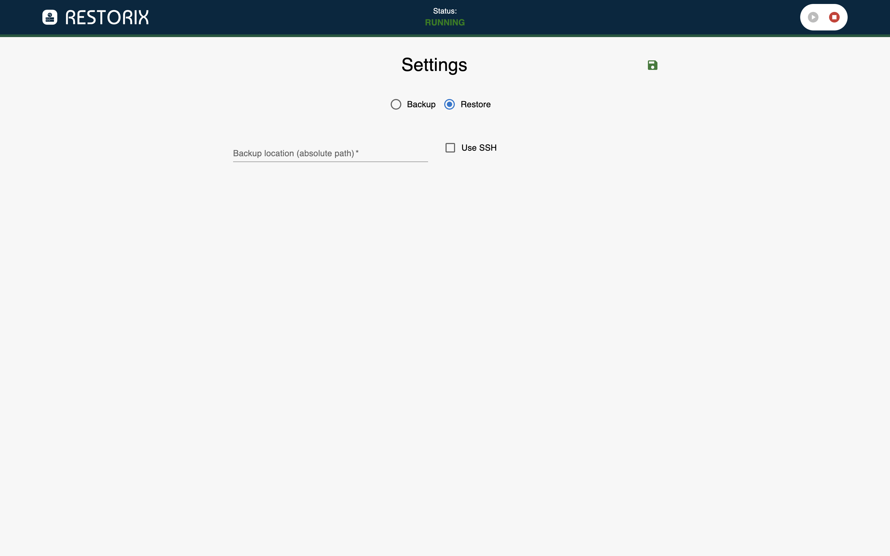

<br />
<br />
# RESTORIX
RESTORIX, created and idealized by André Oliveira ([SpecialAro](https://github.com/specialaro)), is a WebUI for [restorix-core](https://github.com/specialaro/restorix-core) that allows users to backup, restore and migrate docker volumes easily through an Web Interface. Backups are stored in `tar` files locally (in the path specified by the user) or remotely using an SSH connection.
<br />
<details>
    <summary>Screenshots</summary>




</details>
<br />

## Current Limitations
### SSH Connection
Currently, the SSH connection is done through `scp` using a username and a password. SSH Keys are not supported at the moment.

### Alpha Stage
This project is currently in alpha stage, meaning that the tool is not yet production ready and that several features might not work as expected. Please, make sure to follow all the instructions provided in the documentation to minimize the risk of faulty backups/restore/migration.
<br />
<br />

## How to use
To use RESTORIX you need to have docker installed (duh!). For the time being only instructions for `docker compose` are available. Then, all you need to do is change the settings and run!
<br />
<b>Make sure you save the settings before running, otherwise it will run with the previous stored/last run settings!</b>

### Docker Compose
```
version: "3"

services:
  app:
    image: specialaro/restorix:latest
    container_name: restorix
    restart: always
    environment:
      # Change the next line if you're using RESTORIX behind a reverse proxy
      - SERVER_BASEURL=http://localhost:3000
    ports:
      - "3000:3000"
    volumes:
      - data:/app/data
      - /var/run/docker.sock:/var/run/docker.sock
volumes:
  data:
```
<br />

## Contributing
Contributions are very much welcomed even though the license is still not yet defined. If you think of a cool feature, see a problem that needs solution, or have a suggestion to make, please use the [issue board](https://github.com/specialaro/restorix/issues).
<br />
<br />

## License
This project is yet to be licensed but the general intent is to keep it Open Source.
<br />
<br />

## Disclaimer
<b>We are not resposible for any data loss or faulty backups when using this tool. Please, take responsability for your actions and test this tool in a safe enviornment before you use it.</b>